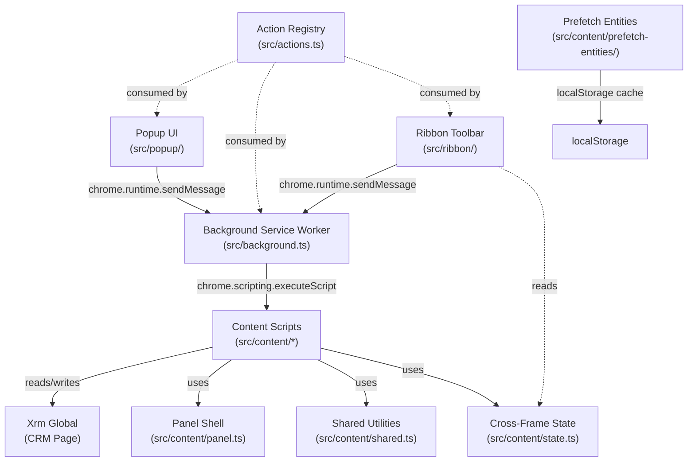

# Architecture

## Overview

DynamicsCat is a Chrome Extension (Manifest V3) that provides developer tools for Dynamics CRM 2016 forms. It injects content scripts into CRM pages to inspect form fields, option sets, hidden fields, and record state via the `Xrm` JavaScript API. Tools are accessible through a browser-action popup and an auto-injected ribbon toolbar on CRM pages.

## Component Diagram

## Components

### Action Registry (`src/actions.ts`)
- **Purpose:** Single source of truth defining all available tools. Each action maps a name to a content script file, label, icon, and optional conditional visibility.
- **Dependencies:** None
- **Dependents:** Popup, Background Service Worker, Ribbon Toolbar

### Background Service Worker (`src/background.ts`)
- **Purpose:** Listens for messages from popup and ribbon, dispatches content scripts via `chrome.scripting.executeScript`. Also handles the `probeActivatable` message for conditional action visibility.
- **Dependencies:** Action Registry
- **Dependents:** Popup (indirectly via message passing), Ribbon Toolbar (via message passing)

### Popup (`src/popup/`)
- **Purpose:** Browser-action popup UI. Renders buttons from the action registry and sends messages to the background worker to inject content scripts into the active tab.
- **Dependencies:** Action Registry, Background Service Worker (via `chrome.runtime.sendMessage`)
- **Dependents:** None (user-facing entry point)

### Ribbon Toolbar (`src/ribbon/ribbon-toolbar/`)
- **Purpose:** Auto-injected toolbar button in the CRM navigation bar (`#navBar`). Opens a dropdown menu mirroring the popup's action set. Runs in the ISOLATED world and delegates to background via messaging. Re-injects itself after CRM SPA navigation via MutationObserver.
- **Dependencies:** Action Registry, Cross-Frame State, Background Service Worker (via messaging)
- **Dependents:** None (user-facing entry point)

### Panel Shell (`src/content/panel.ts`)
- **Purpose:** Shared factory for panel chrome — creates the container, header with title and close button, draggable behavior, CSS isolation, search bar, and copy-to-clipboard spans. Feature scripts call `createPanelShell()` and populate the returned `body` element.
- **Dependencies:** Shared Utilities
- **Dependents:** All Fields, Option Sets, Jump to Latest

### Shared Utilities (`src/content/shared.ts`)
- **Purpose:** Cross-cutting helpers bundled inline into each content script: `debounce`, `buildLabelMap` (Xrm control labels), `makeDraggable`, `copyToClipboard`, `showToast`.
- **Dependencies:** None
- **Dependents:** All content scripts

### Cross-Frame State (`src/content/state.ts`)
- **Purpose:** Toggle state coordination across CRM iframes. Stores flags on the top-frame `document.documentElement.dataset` so multiple frames can detect whether a tool is active. Provides `acquireToggleLock` to prevent duplicate execution when `allFrames: true` injects the same script into multiple frames.
- **Dependencies:** None
- **Dependents:** Show Hidden Fields, Dirty Fields, Ribbon Toolbar

### All Fields (`src/content/all-fields/`)
- **Purpose:** Reads all `Xrm.Page` attributes and renders a sortable, searchable side panel showing label, schema name, type, and value for every field on the form.
- **Dependencies:** Panel Shell, Shared Utilities
- **Dependents:** None

### Option Sets (`src/content/option-sets/`)
- **Purpose:** Filters form attributes to optionset/multiselectoptionset types and displays current value plus all available options with click-to-copy values.
- **Dependencies:** Panel Shell, Shared Utilities
- **Dependents:** None

### Show Hidden Fields (`src/content/show-hidden-fields/`)
- **Purpose:** Toggle script that reveals all controls where `getVisible() === false`, or hides them again. Tracks revealed field names in cross-frame state.
- **Dependencies:** Shared Utilities, Cross-Frame State
- **Dependents:** None

### Dirty Fields (`src/content/dirty-fields/`)
- **Purpose:** Toggle script that subscribes to `onChange` on every attribute and visually highlights fields as they change. Injects a dynamic `<style>` targeting CRM's `{name}_d` row wrappers.
- **Dependencies:** Shared Utilities, Cross-Frame State
- **Dependents:** None

### Open on API (`src/content/open-on-api/`)
- **Purpose:** Opens the current CRM record as raw JSON in a new tab via the Dynamics Web API (`/api/data/v8.2/` or `v9.0`).
- **Dependencies:** Shared Utilities
- **Dependents:** None

### Jump to Latest (`src/content/jump-to-latest/`)
- **Purpose:** Dialog panel for picking any entity and opening its most recently modified or created record. Uses OData `$orderby` and `$top=1`. Entity metadata is cached in localStorage with a 7-day TTL.
- **Dependencies:** Panel Shell, Shared Utilities
- **Dependents:** Prefetch Entities (shares the same cache key)

### Activate Activity (`src/content/activate-activity/`)
- **Purpose:** Reactivates a closed activity by PATCHing `statecode=0, statuscode=1` via the Web API. Only visible when the current record's statecode is non-zero (conditionally shown via `probeActivatable`).
- **Dependencies:** Shared Utilities
- **Dependents:** None

### Prefetch Entities (`src/content/prefetch-entities/`)
- **Purpose:** Lightweight content script registered in the manifest (runs on every CRM page load in MAIN world). Pre-populates the localStorage entity metadata cache so the Jump to Latest panel opens instantly.
- **Dependencies:** None (standalone, shares cache key with Jump to Latest)
- **Dependents:** None

## Technology Stack

- **Language:** TypeScript (strict mode, ES2020 target)
- **Build:** esbuild (IIFE bundles, chrome120 target)
- **Runtime:** Chrome Extension Manifest V3
- **Type definitions:** `@types/chrome`, `@types/xrm`
- **Linting:** ESLint 9 with typescript-eslint
- **Target platform:** Dynamics CRM 2016 (Web API v8.2) and Dynamics 365 (v9.0)
